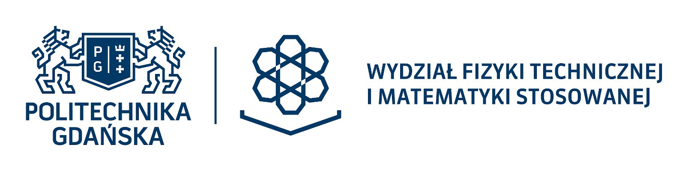

 


##### PROJEKT (własny) z Politechniki Gdańskiej
---

### Analiza danych filmowych na platformie Netflix

#### Wstęp
Projekt dotyczy analizy danych filmowych na platformie Netflix.

Oparty jest na wybranych danych  dotyczących Systemu Rekomendacji Filmów.
- tytuły filmów
- czas wydania, najważniejsze gatunki filmów
- oceny i daty jej wystawienia

#### Cel projektu 
1. Nie jest związany z wszystkimi pobranymi danymi.
2. Nie wykorzystuję indywidualnych danych związanych z użytkownikami.
3. Nie chodzi o rekomendowanie, reklamowanie tytułów widzom na podstawie zebranych o nich danych, prefencji.

```
Najpierw przeprowadziłem prognozowanie wyników w przedziale czasu obejmującym zebrane dane (interpolacja).

Potem prognozowałem przyszłe wyniki (do 2030 r.) na podstawie zebranych danych (ekstrapolacja).
```

##### Badania oparłem na regresji wielomianowej.
- Interpolacja – metoda dla znajdowania wartości pośrednich w obecnych czasach obejmujących zebrane dane.
- Ekstrapolacja – metoda prognozowania przyszłych wyników na podstawie zebranych wcześniej danych. 

```
Projekt oparty został na otwartych danych z platformy Kaggle.
AUTOR zbioru zebranych danych (z Kaggle): Bandi Karthik
Movie Recommendation System
```

